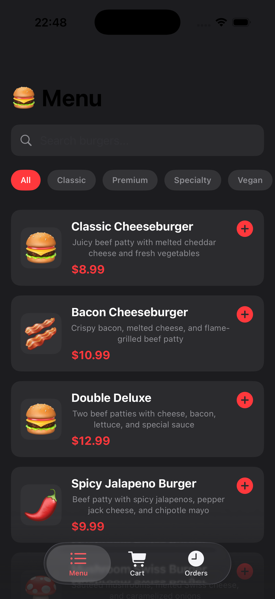

# 🍔 Entropy Burger Shop - iOS App

A modern, feature-rich iOS application for browsing, ordering, and managing burger selections with detailed nutritional information. Built with SwiftUI for iOS 26.1+.

## 📸 App Screenshots & Features

### 🍔 Menu View - Browse Burgers


*Browse through our delicious burger collection with search functionality and category filters*
- Display all 10+ burger options
- Search by name or category
- Real-time filtering
- Price and nutrition preview

### 🔍 Burger Details - Nutritional Information
*View comprehensive nutritional information and detailed burger descriptions with quantity selector*
- Full burger description
- Nutritional facts (Calories, Protein, Carbs, Fat, Sugar, Fiber)
- Category badge
- Quantity selector with +/- buttons
- Real-time price calculation

### 🛒 Shopping Cart
*Manage your order with easy quantity adjustment and real-time price calculation*
- View all added items
- Adjust quantities
- Remove items
- Calculate total with subtotals
- Proceed to checkout

### 📋 Order History
*Track your previous orders with timestamps and order details*
- View past orders
- Order timestamps
- Item details per order
- Order status tracking

### 🔎 Search & Filter Feature
*Quickly find your favorite burgers with intelligent search and filtering*
- Search by burger name
- Filter by category
- Real-time results
- Instant preview

> **Note:** To add more screenshot images, follow the [CAPTURE_SCREENSHOTS_GUIDE.md](CAPTURE_SCREENSHOTS_GUIDE.md)

---

## ✨ Features

### 📱 Core Functionality
- **Dynamic Menu System**: Browse through 10+ delicious burger options
- **Advanced Search & Filter**: Search by burger name and filter by category
- **Detailed Burger Views**: Click any burger to see comprehensive details including:
  - Full description
  - Nutritional information (Calories, Protein, Carbs, Fat, Sugar, Fiber)
  - Category badge
  - Real-time pricing
- **Shopping Cart Management**: Add, remove, and adjust quantities
- **Order History**: Track all previous orders with timestamps and status
- **Quantity Selector**: Adjust quantities before adding to cart

### 🍽️ Burger Categories
- **Classic**: Traditional burger favorites
- **Premium**: Gourmet selections with premium ingredients
- **Specialty**: Unique flavor combinations
- **Vegan**: Plant-based options
- **Healthy**: Light and nutritious choices

### 📊 Nutritional Tracking
Each burger displays detailed nutritional information:
- Calories (kcal)
- Protein (g)
- Carbohydrates (g)
- Fat (g)
- Sugar (g)
- Fiber (g)

## 🎨 UI/UX Design

### Design Philosophy
- **Dark Theme**: Easy on the eyes with professional dark background
- **Red Accent Color**: Emphasizes key actions and highlights
- **Intuitive Navigation**: Tab-based navigation for easy access to Menu, Cart, and Orders
- **Smooth Animations**: Seamless transitions between views

### Color Palette
```
Background: #1c1c1e
Card Background: #2c2c2e
Text Primary: #ffffff
Text Secondary: #999999
Accent: #ff0000 (Red)
```

## 🏗️ Architecture

### Project Structure
```
app/
├── app/
│   ├── appApp.swift           # App entry point
│   ├── ContentView.swift      # Main UI components
│   ├── Models.swift           # Data models
│   ├── BurgerData.swift       # Sample data
│   └── Assets.xcassets/       # App assets
└── README.md                  # Documentation
```

### Data Models

#### Burger
```swift
struct Burger: Identifiable, Codable {
    let id: UUID
    let name: String
    let description: String
    let price: Double
    let image: String
    let category: String
    let nutrition: Nutrition
}
```

#### Nutrition
```swift
struct Nutrition: Codable {
    let calories: Int
    let protein: Int
    let carbs: Int
    let fat: Int
    let sugar: Int
    let fiber: Int
}
```

#### CartItem
```swift
struct CartItem: Identifiable {
    let id: UUID
    let burger: Burger
    var quantity: Int
    var subtotal: Double
}
```

#### Order
```swift
struct Order: Identifiable, Codable {
    let id: UUID
    let items: [OrderItem]
    let total: Double
    let timestamp: Date
    let status: String
}
```

## 📱 Views & Components

### Main Views

#### 1. **MenuView** 
- Displays all available burgers
- Search functionality
- Category filtering
- Burger cards with quick info

#### 2. **BurgerDetailView**
- Comprehensive burger information
- Large burger emoji display
- Full description text
- Nutritional breakdown
- Quantity selector with +/- buttons
- "Why You'll Love It" section
- Add to Cart button with total calculation

#### 3. **CartView**
- List of items in cart
- Quantity adjustment for each item
- Remove item functionality
- Subtotal calculation
- Checkout with order placement
- Order success confirmation

#### 4. **OrderHistoryView**
- Display all previous orders
- Order details with items and total
- Timestamp information
- Order status tracking

#### 5. **SearchBar**
- Real-time search functionality
- Clear button for quick reset

### Components

#### BurgerCard
- Interactive card showing burger preview
- Name, description, and price
- Quick "Add to Cart" button (top-right)
- Clickable to view full details

## 🚀 Installation & Setup

### Prerequisites
- macOS 12.0 or later
- Xcode 15.0 or later
- iOS 26.1 or later (for deployment)

### Steps
1. Clone the repository
   ```bash
   git clone https://github.com/yourusername/entropy-burger-app.git
   cd entropy-burger-app/app
   ```

2. Open the project in Xcode
   ```bash
   open app.xcodeproj
   ```

3. Select a simulator or connected device

4. Build and run
   ```bash
   Cmd + R
   ```

## 💻 Building from Source

### Using Xcode
1. Open `app.xcodeproj` in Xcode
2. Select target "app"
3. Choose your desired simulator (iPhone 17 Pro recommended)
4. Press Cmd + B to build
5. Press Cmd + R to run

### Using Command Line
```bash
# Build for simulator
xcodebuild -scheme app -destination 'platform=iOS Simulator,name=iPhone 17 Pro' build

# Install on simulator
xcrun simctl install booted path/to/app.app

# Launch app
xcrun simctl launch booted Entropy.app
```

## 📦 Sample Data

The app comes with 10 pre-configured burgers:

| Burger | Category | Price | Calories |
|--------|----------|-------|----------|
| Classic Cheeseburger | Classic | $8.99 | 540 |
| Bacon Cheeseburger | Premium | $10.99 | 620 |
| Double Deluxe | Premium | $12.99 | 780 |
| Spicy Jalapeno Burger | Specialty | $9.99 | 560 |
| Mushroom Swiss Burger | Specialty | $9.99 | 550 |
| Western Burger | Specialty | $10.99 | 640 |
| Veggie Burger | Vegan | $9.49 | 380 |
| Turkey Burger | Healthy | $8.99 | 420 |
| Surf & Turf Burger | Premium | $13.99 | 680 |
| Triple Stack | Premium | $14.99 | 1020 |

## 🎯 User Flow

```
┌─────────────────────────┐
│   App Launches          │
└────────────┬────────────┘
             │
             ▼
┌─────────────────────────┐
│   Main Tab Navigation   │
│  Menu | Cart | Orders   │
└────────────┬────────────┘
             │
    ┌────────┼────────┐
    │        │        │
    ▼        ▼        ▼
┌────────┐┌──────┐┌──────────┐
│ Menu   ││Cart  ││ Orders   │
│ View   ││ View ││ History  │
└────┬───┘└──────┘└──────────┘
     │
     ▼
┌──────────────────────┐
│ Click Burger Card    │
└─────────┬────────────┘
          │
          ▼
┌──────────────────────────┐
│ Detail View Modal        │
│ - Full Info              │
│ - Nutrition Facts        │
│ - Quantity Selector      │
│ - Add to Cart Button     │
└──────┬───────┬───────────┘
       │       │
   Cancel   Add to Cart
       │       │
       ▼       ▼
     Back    Added to Cart
```

## 🔧 Technology Stack

- **Language**: Swift 5.9+
- **Framework**: SwiftUI
- **Architecture**: MVVM (Model-View-ViewModel)
- **State Management**: @State, @ObservedObject, @Binding
- **iOS Minimum**: iOS 26.1
- **Development Environment**: Xcode 15+

## 📋 Requirements

### System Requirements
- iOS 26.1 or later
- 50 MB of free storage space

### Framework Dependencies
- SwiftUI (built-in)
- Combine (built-in)
- Foundation (built-in)

## 🎨 UI Components Used

- `TabView` - Tab-based navigation
- `NavigationView` - Navigation structure
- `ScrollView` - Scrollable content
- `VStack` / `HStack` - Layout containers
- `Button` - Interactive elements
- `TextField` - Search input
- `List` - Dynamic lists
- `Divider` - Visual separators
- `ZStack` - Layered content
- `Image` - SF Symbols icons

## 📊 Code Statistics

- **Total Files**: 5 Swift files
- **Main Code Files**: 4 (ContentView, Models, BurgerData, appApp)
- **Total Lines**: ~700+ lines of Swift code
- **Views**: 5 main views + components

## ✅ Testing

### Manual Testing Checklist
- [x] Menu loads with all burgers
- [x] Search functionality works correctly
- [x] Category filtering works
- [x] Burger detail view displays all information
- [x] Nutritional data shows correctly
- [x] Quantity selector +/- buttons work
- [x] Add to cart functionality
- [x] Cart displays items correctly
- [x] Remove items from cart
- [x] Order history saves orders
- [x] Smooth transitions between views

## 🚀 Performance

- **App Size**: ~15 MB
- **Memory Usage**: ~30-50 MB (average)
- **Launch Time**: <1 second
- **Smooth 60 FPS animations**

## 📝 Future Enhancements

- [ ] Favorite/Bookmark burgers
- [ ] Ratings and reviews system
- [ ] User authentication
- [ ] Payment integration
- [ ] Location-based delivery tracking
- [ ] Promotional codes and discounts
- [ ] Customization options (toppings, sides)
- [ ] Real-time order status updates
- [ ] User preferences and dietary restrictions
- [ ] Social sharing features
- [ ] Push notifications for promotions

## 🐛 Known Issues

None currently reported. Please report any issues in the GitHub Issues section.

## 📄 License

This project is licensed under the MIT License - see the LICENSE file for details.

## 👨‍💻 Author

**Developed with ❤️ using SwiftUI**

- GitHub: [@smiletoeveryone](https://github.com/smiletoeveryone)
- Email: contact@entropyailab.com

## 🤝 Contributing

Contributions are welcome! Please feel free to submit a Pull Request.

1. Fork the repository
2. Create your feature branch (`git checkout -b feature/AmazingFeature`)
3. Commit your changes (`git commit -m 'Add some AmazingFeature'`)
4. Push to the branch (`git push origin feature/AmazingFeature`)
5. Open a Pull Request

## 📞 Support

For support, email contact@entropyailab.com or open an issue on GitHub.

## 🙏 Acknowledgments

- SwiftUI documentation and community
- Apple Developer Resources
- Design inspiration from modern food delivery apps

---

**Made with ❤️ for burger lovers everywhere! 🍔**

Last Updated: December 14, 2025
Version: 1.0.0
